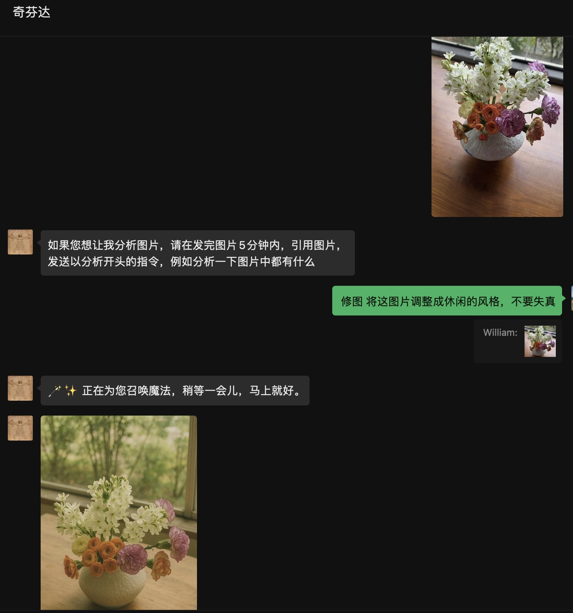
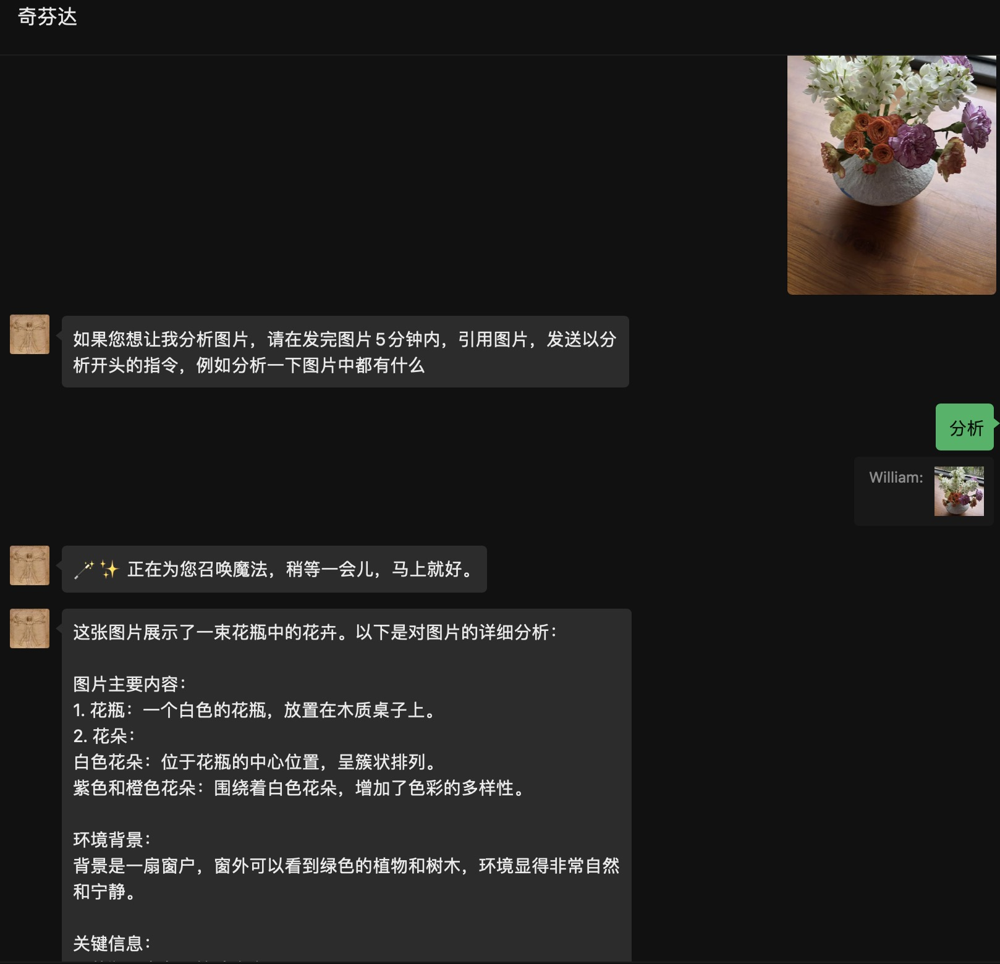

# image2text 项目说明
可用于dify-on-wechat和chatgpt-on-wechat的插件，现在已适配xxxbot-pad，用于图生文、图生图，支持配置多个关键字来调用不同的模型，支持兼容openai的API接口。

# 使用说明

## 1、在私聊和群聊时，发送图片，AI会发出使用指引

如果您想让我分析图片，请在发完图片5分钟内，引用图片，发送以分析开头的指令，例如分析一下图片中都有什么

## 2、引用图片，说出关键字+prompt

插件会根据config.json配置文件里面配置的关键字，寻找对应的匹配项，根据关键字的配置调用不同的API去处理图片

```bash
例如： 配置的关键字为“分析”，那么就是引用图片后，写上 分析整张照片的内容

```
## 3、配置文件说明

```bash
  "#invoking_reply#": "🪄✨ 正在为您召唤魔法，稍等一会儿，马上就好。",    #这是引用图片发给AI后，AI第一时间的反馈响应语
  "#error_reply#": "😮‍💨看起来像是服务器在做深呼吸，稍等一下，它会回来的。",  #这是引用图片发给AI后，AI处理异常的反馈响应语
  "修图": {   #关键字
       "response_type": "image", #返回的类型，有些API返回文本，有些直接返回url，如果返的是url，这一项设置为image，如果是返回文本，则这一项为text，默认为text，此项可以不用添加
       "open_ai_api_base": "https://xxxx/v1/chat/completions",  #这是调用URL,兼容openai格式，必填
       "open_ai_api_key": "sk-xxxxxkey", #对应的鉴权key，必填
       "open_ai_model": "gpt",#调用的模型，必填
       "prompt":  "你是一个修图专家，根据用户的要求对图片和照片进行修改完善", #提示词，可以为空
       "response_regex": "https://[^\\s\\)]+?\\.png" #正则表达式，主要是为了支持灵活适配不同API返回的格式。如果没有可以为空
  }
```


## 4、效果如下图
<div align="center">

</div>

<div align="center">

</div>


安装后，记得cp config.json.template config.json

config.json 配置说明

```bash
{
  "#invoking_reply#": "🪄✨ 正在为您召唤魔法，稍等一会儿，马上就好。",
  "#error_reply#": "😮‍💨看起来像是服务器在做深呼吸，稍等一下，它会回来的。",
  "分析": {
       "response_type": "text",
       "open_ai_api_base": "xxx",
       "open_ai_api_key": "xxx",
       "open_ai_model": "xxx",
       "prompt":  "根据用户的问题，先全局分析图片的主要内容，并按照逻辑分层次、段落，提炼出图片中与用户问题相关的信息、关键要点"
  },
  "修图": {
       "response_type": "image", #返回的类型，有些API返回文本，有些直接返回url，如果返的是url，这一项设置为image，如果是返回文本，则这一项为text，默认为text，此项可以不用添加
       "open_ai_api_base": "https://xxxx/v1/chat/completions",  #这是调用URL,兼容openai格式，必填
       "open_ai_api_key": "sk-xxxxxkey", #对应的鉴权key，必填
       "open_ai_model": "gpt",#调用的模型，必填
       "prompt":  "你是一个修图专家，根据用户的要求对图片和照片进行修改完善", #提示词，可以为空
       "response_regex": "https://[^\\s\\)]+?\\.png" #正则表达式，主要是为了支持灵活适配不同API返回的格式。如果没有可以为空    
  }
}

```

