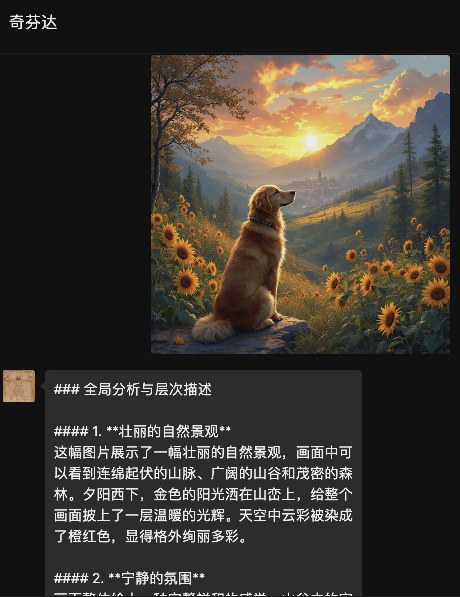
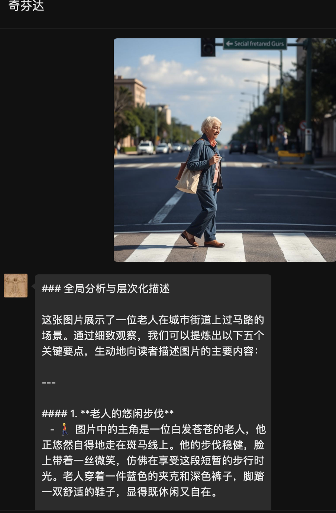

# image2text
可用于dify-on-wechat和chatgpt-on-wechat的插件，现在已适配xxxbot-pad，用于图生文、图生图，支持配置多个关键字来调用不同的模型，支持兼容openai的API接口。


0.0.1已发布


效果如下图
<div align="center">

</div>

<div align="center">

</div>


安装后，记得cp config.json.template config.json

config.json 配置说明

```bash
{
  "#invoking_reply#": "🪄✨ 正在为您召唤魔法，稍等一会儿，马上就好。",
  "#error_reply#": "😮‍💨看起来像是服务器在做深呼吸，稍等一下，它会回来的。",
  "分析": {
       "open_ai_api_base": "xxx",
       "open_ai_api_key": "xxx",
       "open_ai_model": "xxx",
       "prompt":  "根据用户的问题，先全局分析图片的主要内容，并按照逻辑分层次、段落，提炼出图片中与用户问题相关的信息、关键要点"
  },
  "看看": {
       "open_ai_api_base": "xxx",
       "open_ai_api_key": "xxx",
       "open_ai_model": "xxxx",
       "prompt":  "请仔细观察以下图片，提取用户所关注的内容"
  }
}

```

